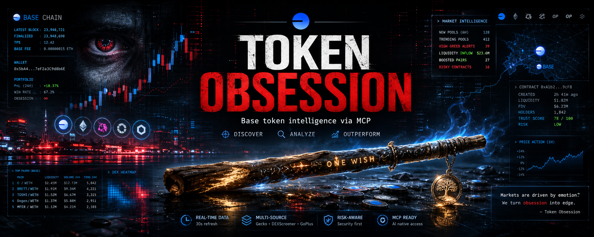

# token-obsession

`token-obsession` is a Base-first MCP server for ranked token discovery.

This project currently gives us:

- a Python package managed by `uv`
- a FastAPI app that hosts a remote MCP server over Streamable HTTP
- four initial ranking strategies:
  - `fresh_quality`
  - `safer_momentum`
  - `established_trending_24h`
  - `high_greed_high_risk`
- GeckoTerminal-backed discovery for Base when a CoinGecko API key is configured
- DEX Screener enrichment for liquidity, pair activity, and boost context
- Birdeye trending confirmation and backfill when a Birdeye API key is configured
- local position tracking for manually bought tokens
- configurable sell evaluation using live DEX Screener market data
- a scheduled worker that can build and propose Uniswap sell transactions to Safe Wallet
- placeholder in-memory token data and scoring as a fallback when no live API key is set

## Quickstart

1. Install dependencies:

```bash
uv sync
```

2. If you want live provider data, set one or both API keys:

```bash
export TOKEN_OBSESSION_COINGECKO_API_KEY=your_key_here
export TOKEN_OBSESSION_BIRDEYE_API_KEY=your_key_here
```

If you are using a CoinGecko Demo key, also set:

```bash
export TOKEN_OBSESSION_COINGECKO_BASE_URL=https://api.coingecko.com/api/v3
```

3. Start the app:

```bash
uv run uvicorn token_obsession.api.app:app --reload
```

4. Visit the health endpoint:

```bash
curl http://127.0.0.1:8000/health
```

5. Connect an MCP client to:

```text
http://127.0.0.1:8000/mcp
```

## Current MCP Tools

- `scan_tokens`
- `explain_token`
- `compare_tokens`
- `add_position`
- `list_positions`
- `close_position`
- `evaluate_positions_for_sell`

## Sell Evaluation

`evaluate_positions_for_sell` checks every open position and returns `sell`, `watch`,
`hold`, or `no_data`. It only recommends an action; it never submits a transaction or
closes a stored position.

The default thresholds are:

- take profit at `30%`
- stop loss at `15%`
- price drop of `10%` over `h1`
- volume-pace drop of `50%` for `m5_vs_h1`
- two market deterioration signals required for `sell`

All thresholds and windows can be overridden per MCP call. Pass `null` for a percentage
threshold to disable that rule. Price windows support `m5`, `h1`, `h6`, and `h24`.
Volume windows support `m5_vs_h1`, `h1_vs_h6`, and `h6_vs_h24`; each compares the
per-minute volume pace in the recent window with the preceding part of the longer window.

## Automated Safe Sell Worker

The sell worker runs separately from FastAPI. Every 30 minutes by default it:

1. reconciles existing Safe proposals and closes positions whose sells executed
2. evaluates every open position with the configured sell rules
3. converts the tracked human quantity using the token's on-chain decimals
4. requests a same-chain Base token-to-USDC route from the Uniswap Trading API
5. builds the returned reset/approval plus swap batch when approval is needed
6. signs the proposal with an authorized Safe delegate and posts it to Safe

The delegate can propose a transaction but cannot approve or execute it. Never configure a
Safe owner private key as the delegate key.

Copy the required values from `.env.example` into `.env`. Proposal submission remains off
until this explicit safety switch is enabled:

```bash
TOKEN_OBSESSION_SELL_PROPOSALS_ENABLED=true
```

The required live settings are:

- `TOKEN_OBSESSION_BASE_RPC_URL`
- `TOKEN_OBSESSION_SAFE_ADDRESS`
- `TOKEN_OBSESSION_SAFE_API_KEY`
- `TOKEN_OBSESSION_SAFE_DELEGATE_PRIVATE_KEY`
- `TOKEN_OBSESSION_UNISWAP_API_KEY`

The Uniswap API key is required. The integration requests only classic Uniswap V2/V3/V4
routes and disables Permit2 signatures so approval and swap calls can be proposed as one
Safe transaction. `TOKEN_OBSESSION_UNISWAP_SWAP_DEADLINE_MINUTES` controls how long the
proposed swap remains executable and defaults to 24 hours.

Run one safe dry monitoring pass while proposal submission is disabled:

```bash
uv run token-obsession-sell-worker --once
```

Run continuously using `TOKEN_OBSESSION_SELL_CHECK_INTERVAL_MINUTES`:

```bash
uv run token-obsession-sell-worker
```

Override the interval for one process:

```bash
uv run token-obsession-sell-worker --interval-minutes 15
```

Pending proposals are persisted in `.token_obsession/sell_proposals.json`, preventing the
worker from submitting the same position every cycle. Build, quote, reconciliation, and
proposal failures are logged with `SELL ACTION REQUIRED` so an email notifier can be added
later without changing the transaction flow.

## Next Steps

- add security/risk enrichment after DEX Screener
- add discovery and enrichment workers
- persist canonical token, pool, and snapshot models
- tune scoring with real observations
